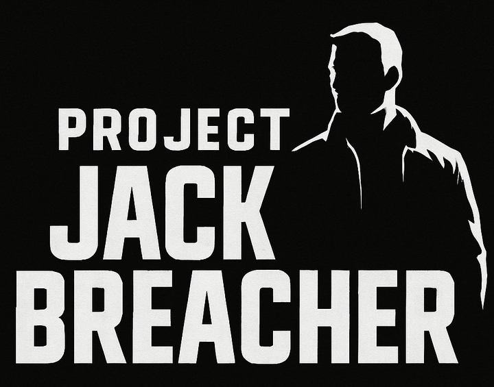

# Welcome to project Jack Breacher 

Cyberattacks aren’t just rising — they’re evolving. Every day, thousands of intrusion attempts target systems around the world, growing more complex and harder to detect. As more organizations shift their operations to the cloud, staying ahead of these threats has never been more important.

In this project, we dig into real honeypot data to better understand attacker behavior. Where are most of the attempts coming from? When do they happen? And what signs can help us catch them before they succeed? By combining data analysis, geolocation, and machine learning, we uncover patterns that can help teams strengthen their defenses and stay one step ahead.

## Modules/Libaries 
* Pandas
* Seaborn
* Numpy
* MatplotLib
* Scikit-learn
* geoip2.database